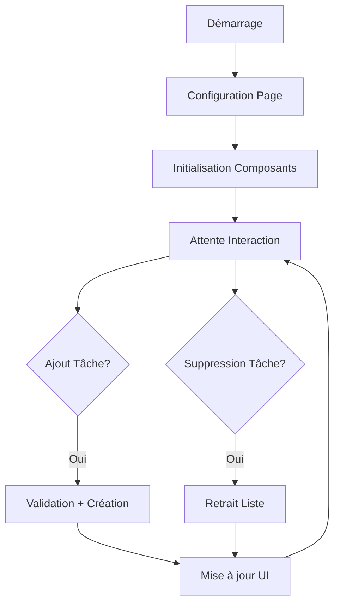

# 📝 Application To-Do List Moderne avec Flet

## 📋 Table des Matières
- [Introduction](#introduction)
- [Installation](#installation)
- [Architecture](#architecture)
- [Composants UI](#composants-ui)
- [Fonctionnalités](#fonctionnalités)
- [Guide d'Utilisation](#guide-dutilisation)
- [API Référence](#api-référence)
- [Personnalisation](#personnalisation)
- [Extension](#extension)
- [Dépannage](#dépannage)
- [FAQ](#faq)

---

## 🎯 Introduction

### Description
Application de gestion de tâches moderne développée avec **Flet**, un framework Python pour applications multiplateformes.

### Caractéristiques Principales
- ✅ Interface Material Design moderne
- ✅ Mode sombre par défaut
- ✅ Ajout/suppression de tâches
- ✅ Marquage des tâches terminées
- ✅ Interface responsive
- ✅ Code simple et maintenable

### Technologies
| Technologie | Version | Rôle |
|------------|---------|------|
| Python | 3.7+ | Langage principal |
| Flet | 0.xx | Framework UI |
| Material Icons | - | Système d'icônes |

---

## 🚀 Installation

### Prérequis
```bash
# Vérifier Python
python --version
# Python 3.7 ou supérieur requis
```

### Installation de Flet
```bash
pip install flet
```

### Exécution de l'Application
```bash
# Méthode 1 : Exécution directe
python todo_app.py

# Méthode 2 : Avec Flet CLI
flet run todo_app.py

# Méthode 3 : Développement web
flet publish todo_app.py
```

### Structure des Fichiers
```
todo_app.py          # Code source principal
requirements.txt     # Dépendances (optionnel)
README.md           # Documentation
```

---

## 🏗️ Architecture

### Diagramme de Flux


### Structure du Code
```python
def main(page: ft.Page):
    # 1. Configuration
    page.title = "..."
    page.theme_mode = "..."
    
    # 2. Variables d'état
    new_task = ft.TextField(...)
    tasks_view = ft.Column()
    
    # 3. Fonctions de gestion
    def add_clicked(e): ...
    def delete_task(task_row): ...
    
    # 4. Interface utilisateur
    page.add(
        ft.Text(...),
        ft.Row(...),
        tasks_view
    )
```

### État de l'Application
| Variable | Type | Description |
|----------|------|-------------|
| `new_task` | `ft.TextField` | Champ de saisie des nouvelles tâches |
| `tasks_view` | `ft.Column` | Conteneur des tâches existantes |
| `page` | `ft.Page` | Instance principale de la page |

---

## 🎨 Composants UI

### Page Principale
| Propriété | Valeur | Description |
|-----------|---------|-------------|
| `title` | "Ma To-Do List Moderne" | Titre de la fenêtre |
| `theme_mode` | `ft.ThemeMode.DARK` | Thème sombre activé |
| `window_width` | 450px | Largeur fixe |
| `window_height` | 600px | Hauteur fixe |
| `horizontal_alignment` | `CENTER` | Centrage horizontal |

### Zone de Saisie
```python
ft.TextField(
    hint_text="Qu'avez-vous à faire ?",
    expand=True,  # Occupe l'espace disponible
    on_submit=add_clicked  # Raccourci Entrée
)
```

### Bouton d'Ajout
```python
ft.FloatingActionButton(
    icon=ft.Icons.ADD,
    tooltip="Ajouter une tâche",
    on_click=add_clicked,
    bgcolor="blue700"
)
```

### Ligne de Tâche (Dynamique)
```python
ft.Row(
    alignment=ft.MainAxisAlignment.SPACE_BETWEEN,
    controls=[
        # Case à cocher avec libellé
        ft.Checkbox(
            label=task_text,
            check_color="white",
            on_change=task_status_changed
        ),
        # Bouton de suppression
        ft.IconButton(
            icon=ft.Icons.DELETE_OUTLINE,
            icon_color="red700",
            tooltip="Supprimer",
            on_click=lambda _: delete_task(task_row)
        )
    ]
)
```

### Liste des Tâches
```python
ft.Column(
    scroll=ft.ScrollMode.AUTO,  # Défilement automatique
    spacing=10,  # Espacement entre lignes
    controls=[],  # Rempli dynamiquement
    expand=True  # Occupe l'espace restant
)
```

---

## ⚙️ Fonctionnalités

### Ajout de Tâche
**Processus :**
1. Saisie dans le champ texte
2. Validation (texte non vide)
3. Création de la ligne de tâche
4. Ajout à la liste
5. Réinitialisation du champ

**Code :**
```python
def add_clicked(e):
    if new_task.value.strip():  # Validation
        task_row = create_task_row(new_task.value)
        tasks_view.controls.append(task_row)
        new_task.value = ""
        page.update()
```

### Suppression de Tâche
**Processus :**
1. Clique sur icône 🗑️
2. Identification de la ligne
3. Retrait de la liste
4. Mise à jour de l'UI

**Code :**
```python
def delete_task(task_row):
    tasks_view.controls.remove(task_row)
    page.update()
```

### Marquage de Tâche
**Comportement :**
- Case à cocher cliquable
- Changement d'état visuel
- Texte barré quand coché (Flet par défaut)

**Personnalisation :**
```python
ft.Checkbox(
    label="Tâche exemple",
    value=False,  # État initial
    check_color="green",  # Couleur de la coche
    fill_color="blue",  # Couleur de fond
    on_change=lambda e: print(f"État : {e.control.value}")
)
```

---

## 📖 Guide d'Utilisation

### Interface Visuelle
```
┌─────────────────────────────────────────┐
│  MES TÂCHES 2025                        │
├─────────────────────────────────────────┤
│ [Saisir une tâche...]              [⊕] │
├─────────────────────────────────────────┤
│                                         │
│ ☐ Acheter du pain                [🗑️]   │
│ ☐ Appeler médecin                [🗑️]   │
│ ☑ Rendre rapport                 [🗑️]   │
│                                         │
│ (défilement si nombreuses tâches)      │
└─────────────────────────────────────────┘
```

### Actions Disponibles
| Action | Méthode | Raccourci |
|--------|---------|-----------|
| Ajouter tâche | Cliquer ⊕ | Touche Entrée |
| Supprimer tâche | Cliquer 🗑️ | - |
| Marquer terminée | Cocher ☐ | Clic case |
| Marquer active | Décocher ☑ | Clic case |

### Workflow Type
1. **Lancement** : L'application s'ouvre avec une liste vide
2. **Ajout** : Saisir "Faire les courses" + Entrée
3. **Ajout multiple** : Répéter pour plusieurs tâches
4. **Organisation** : Cocher les tâches terminées
5. **Nettoyage** : Supprimer les tâches obsolètes
6. **Fermeture** : Les données sont perdues (amélioration possible)

### Conseils d'Utilisation
- Utilisez des descriptions claires et concises
- Marquez les tâches terminées régulièrement
- Supprimez les tâches devenues inutiles
- L'application n'a pas de sauvegarde automatique

---

## 🔧 API Référence

### Fonction `main(page: ft.Page)`
**Description** : Point d'entrée de l'application Flet.

**Paramètres :**
- `page` : Instance de la page, gérée par Flet

**Retour :** Aucun

**Exemple :**
```python
def main(page: ft.Page):
    # Configuration et logique
    pass

ft.app(target=main)  # Lancement
```

### Fonction `add_clicked(e)`
**Description** : Gestionnaire d'événement pour l'ajout de tâches.

**Paramètres :**
- `e` : Événement de clic (`ft.ControlEvent`)

**Variables utilisées :**
- `new_task.value` : Texte saisi
- `tasks_view.controls` : Liste des contrôles

**Effets de bord :**
- Modifie `tasks_view.controls`
- Réinitialise `new_task.value`
- Appelle `page.update()`

### Fonction `delete_task(task_row)`
**Description** : Supprime une tâche spécifique.

**Paramètres :**
- `task_row` : Instance `ft.Row` à supprimer

**Méthodes appelées :**
- `tasks_view.controls.remove(task_row)`
- `page.update()`

### Objet `page`
**Méthodes principales :**
```python
page.update()  # Rafraîchit l'interface
page.add(*controls)  # Ajoute des composants
page.clean()  # Vide la page
```

**Propriétés configurables :**
```python
page.title = "Nouveau titre"
page.theme_mode = ft.ThemeMode.LIGHT
page.window_width = 800
```

---

## 🎨 Personnalisation

### Changement de Thème
```python
# Mode clair
page.theme_mode = ft.ThemeMode.LIGHT

# Mode système
page.theme_mode = ft.ThemeMode.SYSTEM

# Thème personnalisé
page.theme = ft.Theme(
    color_scheme=ft.ColorScheme(
        primary="blue",
        secondary="green"
    )
)
```

### Modifier les Couleurs
| Élément | Propriété | Exemple |
|---------|-----------|---------|
| Titre | `color` | `"blueaccent"` |
| Bouton suppression | `icon_color` | `"red700"` |
| Case à cocher | `check_color` | `"green500"` |
| Fond bouton | `bgcolor` | `"blue700"` |

**Palette de couleurs Flet :**
```
blue50, blue100, ..., blue900 (plus foncé)
blueaccent100, ..., blueaccent700
Même schéma pour toutes les couleurs Material
```

### Redimensionnement
```python
# Fenêtre plus grande
page.window_width = 600
page.window_height = 800

# Police plus grande
ft.Text(size=35, ...)

# Espacement accru
ft.Column(spacing=20, ...)
```

### Ajouter des Icônes Personnalisées
```python
from flet.icons import *

# Icônes disponibles
ADD = Icons.ADD
DELETE = Icons.DELETE_OUTLINE
EDIT = Icons.EDIT
SAVE = Icons.SAVE
```

---

## 🚀 Extension

### 1. Persistance des Données
```python
import json
import os

DATA_FILE = "tasks.json"

def save_tasks():
    tasks_data = []
    for row in tasks_view.controls:
        checkbox = row.controls[0]
        tasks_data.append({
            "text": checkbox.label,
            "completed": checkbox.value
        })
    
    with open(DATA_FILE, "w") as f:
        json.dump(tasks_data, f)

def load_tasks():
    if os.path.exists(DATA_FILE):
        with open(DATA_FILE, "r") as f:
            tasks_data = json.load(f)
        
        for task in tasks_data:
            add_task_from_data(task["text"], task["completed"])
```

### 2. Édition de Tâche
```python
def enable_edit(task_row):
    checkbox = task_row.controls[0]
    edit_field = ft.TextField(
        value=checkbox.label,
        expand=True,
        on_submit=lambda e: save_edit(task_row, edit_field)
    )
    
    # Remplacer la checkbox par le champ d'édition
    task_row.controls[0] = edit_field
    page.update()
```

### 3. Filtrage et Tri
```python
# Boutons de filtrage
filter_buttons = ft.Row([
    ft.ElevatedButton("Toutes", on_click=lambda e: filter_tasks("all")),
    ft.ElevatedButton("Actives", on_click=lambda e: filter_tasks("active")),
    ft.ElevatedButton("Terminées", on_click=lambda e: filter_tasks("completed"))
])

def filter_tasks(filter_type):
    for row in tasks_view.controls:
        checkbox = row.controls[0]
        if filter_type == "active":
            row.visible = not checkbox.value
        elif filter_type == "completed":
            row.visible = checkbox.value
        else:
            row.visible = True
    page.update()
```

### 4. Statistiques
```python
# En-tête avec compteurs
stats_text = ft.Text("0/0 tâches")

def update_stats():
    total = len(tasks_view.controls)
    completed = sum(1 for row in tasks_view.controls 
                    if row.controls[0].value)
    stats_text.value = f"{completed}/{total} tâches"
    page.update()
```

### 5. Recherche
```python
search_field = ft.TextField(
    hint_text="Rechercher une tâche...",
    prefix_icon=ft.Icons.SEARCH,
    on_change=search_tasks
)

def search_tasks(e):
    search_term = search_field.value.lower()
    for row in tasks_view.controls:
        checkbox = row.controls[0]
        row.visible = search_term in checkbox.label.lower()
    page.update()
```

---

## 🐛 Dépannage

### Problèmes Courants

| Symptôme | Cause Possible | Solution |
|----------|---------------|----------|
| Module flet introuvable | Flet non installé | `pip install flet` |
| Fenêtre ne s'ouvre pas | Problème avec Python/Tkinter | Vérifier installation Python |
| Interface non mise à jour | `page.update()` manquant | Ajouter après modifications |
| Tâches vides ajoutées | Validation manquante | Vérifier `new_task.value.strip()` |
| Performance lente | Trop d'appels à `update()` | Regrouper les modifications |

### Debugging
```python
# Ajouter des logs
import logging
logging.basicConfig(level=logging.DEBUG)

def add_clicked(e):
    print(f"[DEBUG] Ajout tâche: '{new_task.value}'")
    print(f"[DEBUG] Nombre de tâches: {len(tasks_view.controls)}")
    # ... reste du code
```

### Tests de Base
```python
# Test 1: Ajout de tâche vide
# Attendu: Rien ne se passe
# Test 2: Ajout de tâche valide
# Attendu: Apparaît dans la liste
# Test 3: Suppression
# Attendu: Disparaît de la liste
# Test 4: Marquage
# Attendu: Case cochée, visuel modifié
```

### Support
- [Documentation Flet](https://flet.dev/docs/)
- [GitHub Issues](https://github.com/flet-dev/flet/issues)
- [Communauté Discord](https://discord.gg/flet)

---

## ❓ FAQ

### Q: Comment sauvegarder mes tâches ?
**R:** L'application actuelle ne sauvegarde pas. Implémentez la persistance avec JSON ou une base de données.

### Q: Puis-je utiliser l'application sur mobile ?
**R:** Oui! Flet supporte iOS et Android. Utilisez `flet run --ios` ou `flet run --android`.

### Q: Comment ajouter des dates d'échéance ?
**R:** Ajoutez un `ft.DatePicker` à chaque ligne de tâche.

### Q: Puis-je partager ma liste ?
**R:** Non dans cette version. Pour le cloud, intégrez une API.

### Q: Y a-t-il un mode hors-ligne ?
**R:** Oui, l'application fonctionne entièrement hors-ligne.

### Q: Comment changer la langue ?
**R:** Remplacez les textes en dur par des variables et ajoutez un système de traduction.

---

## 📈 Améliorations Futures

### Priorité Haute
- [ ] Sauvegarde automatique
- [ ] Édition des tâches existantes
- [ ] Confirmation avant suppression

### Priorité Moyenne
- [ ] Catégories/étiquettes
- [ ] Dates d'échéance
- [ ] Rappels/notifications

### Priorité Basse
- [ ] Synchronisation cloud
- [ ] Thèmes personnalisables
- [ ] Statistiques avancées

---

## 📄 Licence

Ce projet est open-source sous licence MIT. Libre d'utilisation, modification et distribution.

## 👥 Contribution

Les contributions sont les bienvenues !
1. Fork le projet
2. Crée une branche (`git checkout -b feature/AmazingFeature`)
3. Commit tes changements (`git commit -m 'Add AmazingFeature'`)
4. Push vers la branche (`git push origin feature/AmazingFeature`)
5. Ouvre une Pull Request

---

*Dernière mise à jour : 2025*  
*Version : 1.0.0*  
*Auteur : Lmr lumiere*  
*Documentation fait avec ❤️ pour LMR_TODO*

---
